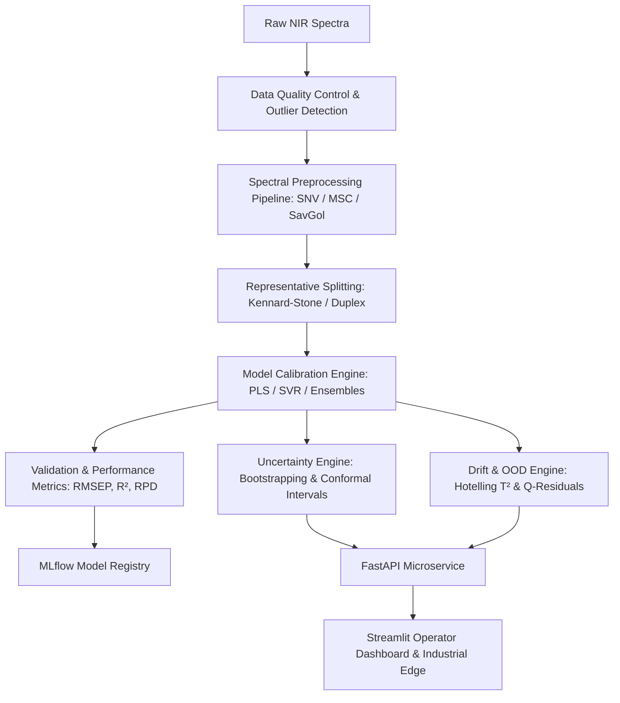

# Industrial NIR Chemometric Calibration & Uncertainty Platform

[](https://www.python.org/)
[](https://fastapi.tiangolo.com/)
[](https://mlflow.org/)
[](https://www.docker.com/)
[](https://opensource.org/licenses/MIT)

An end-to-end, enterprise-grade chemometric calibration and uncertainty quantification platform engineered for Near-Infrared (NIR) spectroscopy in industrial Process Analytical Technology (PAT) environments. 

This platform bridges the gap between traditional chemometrics and modern machine learning, providing automated spectral preprocessing pipelines, robust calibration modeling (PLS, PCR, SVR, Ensembles), rigorous uncertainty quantification (Bootstrapping & Conformal Prediction), and out-of-distribution (OOD) drift detection—all exposed via RESTful microservices and an interactive operator dashboard.

---

## 📌 Executive Summary & Industry Impact

In modern industrial quality control (pharmaceuticals, petrochemicals, agriculture, food processing), **Near-Infrared (NIR) Spectroscopy** is the gold standard for non-destructive, inline real-time measurement. However, NIR spectra suffer from:
1. **Physical Interference**: Particle size variations, scattering, baseline shifts, and temperature fluctuations.
2. **High Collinearity**: Hundreds to thousands of correlated wavelength variables per sample.
3. **Uncertainty & Model Drift**: Environmental changes and process variations that degrade model confidence over time.

This platform addresses these challenges by offering a unified workflow from raw spectrum ingestion to real-time risk-aware prediction with confidence bounds.

---

## ✨ Key Capabilities & Features

- 🧪 **Advanced Spectral Preprocessing Library**:
  - Standard Normal Variate (SNV) & Multiplicative Scatter Correction (MSC)
  - Savitzky-Golay (SG) Filtering (Smoothing, 1st & 2nd Derivatives)
  - Min-Max, Vector, and Area Normalization
  - Detrending and Baseline Offset Corrections

- 📊 **Exploratory Data Analysis & Outlier Detection**:
  - Principal Component Analysis (PCA) with Hotelling’s $T^2$ and $Q$-Residual (D-mod-X) limits
  - Spectral band identification and covariance analysis

- 🎯 **Chemometric & Machine Learning Calibration Engines**:
  - Partial Least Squares Regression (PLSR) & Principal Component Regression (PCR)
  - Support Vector Regression (SVR) with RBF/Linear kernels
  - Tree-based Ensembles (Random Forest, XGBoost) & Ridge/Lasso Regularized Models

- 🛡️ **Uncertainty Quantification (UQ) & Risk Management**:
  - Bootstrapped Prediction Intervals (PI) for point-estimate variance
  - Conformal Prediction providing mathematically guaranteed coverage rates ($1 - \alpha$)
  - Real-time confidence score generation for inline process control

- 🔍 **Model Robustness & Drift Monitoring**:
  - Kennard-Stone & Duplex algorithm implementations for representative train/test splitting
  - Spectral distance metrics (Mahalanobis distance) to flag out-of-distribution (OOD) samples

- 🚀 **Production Deployment & MLOps**:
  - **REST API**: Asynchronous prediction engine built with FastAPI
  - **Interactive Dashboard**: Streamlit app for operators, chemometricians, and quality engineers
  - **MLOps**: MLflow integration for model registry, experiment tracking, and artifact management
  - **Containerization**: Fully Dockerized container setup ready for Kubernetes or industrial edge servers

---

## 🏗️ Architecture & Processing Workflow



---

## 📂 Project Directory Structure

```
Industrial-NIR-Chemometric-Calibration-Uncertainty-Platform/
│
├── api/                        # FastAPI REST microservice endpoints
│   └── main.py                 # API router for prediction, preprocessing, and UQ
│
├── dashboard/                  # Streamlit web interface for interactive control
│   └── app.py                  # Operator UI for visualization, inference & diagnostics
│
├── data/                       # Dataset directory (Raw & Processed spectra)
│   ├── raw/                    # Raw NIR spectral files (.csv, .xlsx, .mat)
│   └── processed/              # Preprocessed spectra and reference values
│
├── models/                     # Saved model artifacts, scalers, and MLflow outputs
│
├── notebooks/                  # Sequential research & analysis notebooks
│   ├── 01_data_understanding.ipynb  # EDA, raw spectra inspection, signal-to-noise
│   ├── 02_spectral_analysis.ipynb   # PCA, score plots, spectral band assignment
│   ├── 03_preprocessing.ipynb       # Preprocessing benchmark (SNV, MSC, SavGol)
│   ├── 04_baseline_models.ipynb     # Model calibration (PLS, SVR, Ridge, Random Forest)
│   ├── 05_validation.ipynb          # Kennard-Stone split, CV, RMSEP, RPD metrics
│   ├── 06_uncertainty.ipynb         # Bootstrapping & Conformal Prediction Intervals
│   └── 07_robustness.ipynb          # OOD detection, Hotelling T², model drift checks
│
├── src/                        # Modular core Python library
│   ├── preprocessing.py        # SNV, MSC, Savitzky-Golay, Normalization implementations
│   ├── models.py               # Custom wrappers for PLS, SVR, and Ensemble models
│   ├── validation.py           # Kennard-Stone partitioning, cross-validation utilities
│   └── prediction.py           # Uncertainty inference engine & conformal predictors
│
├── tests/                      # Automated unit and integration test suite
│
├── Dockerfile                  # Production container definition
├── requirements.txt            # Project dependencies
├── main.py                     # CLI entry point
└── README.md                   # Project documentation
```

---

## 📓 Notebook Pipeline Overview

The project is structured across 7 sequential Jupyter notebooks, providing a comprehensive walkthrough of the end-to-end chemometric lifecycle:

1. **`01_data_understanding.ipynb`**: Data ingestion, raw spectral visualization, wavelength range analysis, baseline noise characterization, and summary statistics of target chemical properties.
2. **`02_spectral_analysis.ipynb`**: Exploratory factor analysis using PCA, identifying main spectral variations, leverage analysis, and detecting potential sample outliers using Hotelling's $T^2$.
3. **`03_preprocessing.ipynb`**: Comparison and optimization of baseline correction and scatter reduction methods (SNV vs. MSC vs. 1st/2nd derivative Savitzky-Golay filters).
4. **`04_baseline_models.ipynb`**: Calibration model building using Partial Least Squares Regression (PLSR), Ridge Regression, Support Vector Regression (SVR), and Random Forest.
5. **`05_validation.ipynb`**: Sample selection via the Kennard-Stone algorithm, cross-validation strategies, and evaluation using industry metrics ($R^2$, $RMSEP$, $RMSEC$, $RMSECV$, $RPD$, $RER$).
6. **`06_uncertainty.ipynb`**: Implementation of Bootstrapping and Inductive Conformal Prediction (ICP) to generate reliable, calibrated prediction intervals for real-time predictions.
7. **`07_robustness.ipynb`**: Evaluating model resilience under spectral noise, instrument-to-instrument drift, and out-of-distribution (OOD) sample detection via Mahalanobis distance & $Q$-residuals.

---

## 🛠️ Installation & Setup

### Prerequisites
- Python 3.9+
- Git

### 1. Clone Repository & Create Virtual Environment
```bash
git clone https://github.com/mhdmirzan/Industrial-NIR-Chemometric-Calibration-Uncertainty-Platform.git
cd Industrial-NIR-Chemometric-Calibration-Uncertainty-Platform

# Create virtual environment
python -m venv .venv

# Activate environment
# Windows:
.venv\Scripts\activate
# Linux/macOS:
source .venv/bin/activate
```

### 2. Install Dependencies
```bash
pip install -r requirements.txt
```

---

## 🚀 Usage & Deployment

### Running the FastAPI REST Service
Start the backend server to serve predictions and uncertainty estimates:
```bash
uvicorn api.main:app --host 0.0.0.0 --port 8000 --reload
```
Access interactive API documentation (Swagger UI) at `http://localhost:8000/docs`.

### Running the Interactive Streamlit Dashboard
Launch the operator interface for interactive spectral uploading, model calibration, and uncertainty visualization:
```bash
streamlit run dashboard/app.py
```
Open your browser at `http://localhost:8501`.

### Docker Deployment
Build and run the containerized solution:
```bash
# Build Docker image
docker build -t nir-chemometrics-platform .

# Run Docker container
docker run -p 8000:8000 -p 8501:8501 nir-chemometrics-platform
```

---

## 📊 Evaluation Metrics Glossary

- **RMSEC / RMSECV / RMSEP**: Root Mean Squared Error of Calibration / Cross-Validation / Prediction.
- **$R^2$**: Coefficient of Determination quantifying variance explained.
- **RPD (Ratio of Performance to Deviation)**: $RPD = \frac{SD}{RMSEP}$. Measures calibration suitability ($RPD > 2.5$ indicates high analytical reliability).
- **RER (Ratio of Error Range)**: $RER = \frac{\text{Range}}{RMSEP}$.
- **Conformal Coverage**: Empirical percentage of test samples falling strictly within generated prediction intervals at specified confidence ($1 - \alpha$).

---

## 🤝 Contributing

Contributions are welcome! If you would like to add new preprocessing methods (e.g., EMSC, Wavelet transform) or custom chemometric models:
1. Fork the Repository
2. Create a Feature Branch (`git checkout -b feature/NewPreprocessing`)
3. Commit your changes (`git commit -m 'Add Extended Multiplicative Scatter Correction'`)
4. Push to Branch (`git push origin feature/NewPreprocessing`)
5. Open a Pull Request

---

## 📜 License

Distributed under the **MIT License**. See `LICENSE` for details.
